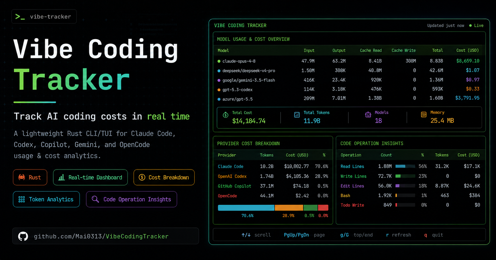

<div align="center" markdown="1">

# Vibe Coding Tracker — AI 编程助手使用量追踪器



[](https://crates.io/crates/vibe_coding_tracker)
[](https://crates.io/crates/vibe_coding_tracker)
[](https://www.npmjs.com/package/vibe-coding-tracker)
[](https://www.npmjs.com/package/vibe-coding-tracker)
[](https://pypi.org/project/vibe_coding_tracker/)
[](https://pypi.org/project/vibe-coding-tracker)
[](https://www.rust-lang.org/)
[](https://github.com/Mai0313/VibeCodingTracker/actions/workflows/test.yml)
[](https://github.com/Mai0313/VibeCodingTracker/actions/workflows/code-quality-check.yml)
[](https://github.com/Mai0313/VibeCodingTracker/tree/main?tab=License-1-ov-file)
[](https://github.com/Mai0313/VibeCodingTracker)
[](https://github.com/Mai0313/VibeCodingTracker/pulls)

</div>

**实时追踪你的 AI 编程开销。** Vibe Coding Tracker 是一款基于 Rust 构建的轻量级高性能 CLI 工具，用于监控和分析你在 Claude Code、Codex、Copilot、Gemini 和 OpenCode 上的使用情况——提供详细的费用明细、token 统计和代码操作洞察，同时保持极低的内存占用。

[English](README.md) | [繁體中文](README.zh-TW.md) | [简体中文](README.zh-CN.md)

> 注意：CLI 示例中使用简写别名 `vct`。如果你是通过 npm/pip/cargo 安装的，二进制文件可能命名为 `vibe_coding_tracker` 或 `vct`。如有需要，请创建别名或在运行命令时将 `vct` 替换为完整名称。

---

## 为什么选择 Vibe Coding Tracker？

### 掌握你的开销

不用再猜测 AI 编程会话到底花了多少钱。通过 [LiteLLM](https://github.com/BerriAI/litellm) 自动更新定价，获取**实时费用追踪**。

### 超轻量级

使用 Rust 构建，资源占用极低。交互式 TUI 面板稳定后常驻内存通常控制在 **约 50 MB 以内**，即使磁盘上有数百个长 context session 文件也不例外——无需 Electron，无需臃肿的运行时。usage 路径以精简模式流式解析每个 session 文件并绕过 cache，启动时还会调整 glibc 的 arena 数量，让长时间运行的 RSS 保持诚实。

### 精美的可视化

选择你喜欢的查看方式：

- **交互式面板**：自动刷新的终端 UI，支持实时更新、可滚动的模型列表（方向键），以及 K/M/B 精简数字格式
- **静态报表**：专业的表格，适合文档记录
- **脚本友好**：纯文本和 JSON 格式，方便自动化
- **完整精度**：导出精确费用，满足财务核算需求

### 零配置

自动检测并处理来自 Claude Code、Codex、Copilot、Gemini 和 OpenCode 的日志。无需任何设置——直接运行即可分析。

### 丰富的洞察

- 按模型和日期统计 token 使用量
- 按 cache 类型（读取/创建）细分费用
- 文件操作追踪（编辑、读取、写入行数）
- 工具调用历史（Bash、Edit、Read、Write、TodoWrite）
- 按供应商统计总计

---

## 核心特性

| 特性             | 说明                                                        |
| ---------------- | ----------------------------------------------------------- |
| **多供应商支持** | Claude Code、Codex、Copilot、Gemini 和 OpenCode——一站式管理 |
| **智能定价**     | 模糊模型匹配 + 从 LiteLLM 每日缓存更新                      |
| **4 种显示模式** | 交互式 TUI、静态表格、纯文本和 JSON                         |
| **双维度分析**   | token/费用统计（`usage`）+ 代码操作统计（`analysis`）       |
| **超轻量级**     | TUI 常驻内存 50 MB 以内、流式 JSONL 解析——基于 Rust 构建    |
| **实时更新**     | 面板每秒自动刷新                                            |
| **高效缓存**     | 智能每日缓存，减少 API 调用次数                             |

---

## 快速开始

### 安装

选择最适合你的安装方式：

> **开发者**：如果你想从源码构建或参与项目开发，请参阅 [CONTRIBUTING.md](.github/CONTRIBUTING.md)。

#### 方式一：通过 npm 安装

**前置条件**：[Node.js](https://nodejs.org/) v22 或更高版本

以下包名任选其一（内容完全相同）：

```bash
# Main package
npm install -g vibe-coding-tracker

# Short alias with scope
npm install -g @mai0313/vct

# Full name with scope
npm install -g @mai0313/vibe-coding-tracker
```

#### 方式二：通过 PyPI 安装

**前置条件**：Python 3.8 或更高版本

```bash
pip install vibe_coding_tracker
# Or with uv
uv pip install vibe_coding_tracker
```

#### 方式三：通过 crates.io 安装

使用 Cargo 从 Rust 官方包注册中心安装：

```bash
cargo install vibe_coding_tracker
```

### 首次运行

```bash
# View your usage with the interactive dashboard
vct usage

# Or run the binary built by Cargo/pip
vibe_coding_tracker usage

# Analyze code operations across all sessions
vct analysis
```

---

## 命令指南

### 快速参考

```
vct <COMMAND> [OPTIONS]
# Replace with `vibe_coding_tracker` if you are using the full binary name

Commands:
  analysis    Analyze JSONL conversation files (single file or all sessions)
  usage       Display token usage statistics
  statusline  Cache Claude Code rate limits from a statusLine hook (stdin JSON)
  version     Display version information
  update      Update to the latest version from GitHub releases
  help        Print this message or the help of the given subcommand(s)
```

时间范围 flag（`usage` 与 `analysis` 共用，互斥，默认 `--all`）：

| Flag          | 范围                         |
| ------------- | ---------------------------- |
| `--daily`     | 今天更新过的 session         |
| `--weekly`    | 本 ISO 周（周一 → 今天）     |
| `--monthly`   | 本自然月                     |
| `-a`, `--all` | 磁盘上所有 session（默认值） |

---

## Usage 命令

**追踪你在所有 AI 编程会话中的开销。**

### Flag 一览

| Flag                                           | 用途                       |
| ---------------------------------------------- | -------------------------- |
| *(不带参数)*                                   | 互动式 TUI 面板（默认）    |
| `--table`                                      | 静态表格，不启动 TUI       |
| `--text`                                       | 纯文本，适合脚本处理       |
| `--json`                                       | JSON 输出，附带定价信息    |
| `--output <FILE>`                              | 将富化 JSON 保存到文件     |
| `--daily` / `--weekly` / `--monthly` / `--all` | 时间范围筛选（见上方表格） |

### 基本用法

```bash
# Interactive dashboard (recommended)
vct usage

# Static table for reports
vct usage --table

# Plain text for scripts
vct usage --text

# JSON 输出，包含 cost_usd 与 matched_model 字段
vct usage --json

# 直接把富化 JSON 保存到文件
vct usage --output report.json

# 时间范围与输出格式可自由组合
vct usage --weekly
vct usage --table --monthly
vct usage --json --daily
```

> [!NOTE]
> Model 行会按 cost 升序排序，因此花费最高的 model 会排在最后（在 `--table` 中紧邻 `TOTAL` 行上方）。该排序适用于交互式面板、`--table` 与 `--text` 三种输出；`--json` 也会保持相同顺序。交互式面板还会隐藏在所选范围内用量为 0 的模型。

### 预览：交互式面板（`vct usage`）

```
┌─────────────────────────────────────────────────────────────────────────────────────────────┐
│ Model                         Input   Output  Cache Read  Cache Write    Total  Cost (USD)  │
│                                                                                             │
│ gemini-3.1-pro-preview         129K    10.3K       67.4K            0     207K       $0.40  │
│ claude-haiku-4-5-20251001     5.57K    19.8K       4.63M         620K    5.27M       $1.34  │
│ claude-opus-4-6               25.7K     179K       40.8M        2.57M    43.6M      $77.59  │
└─────────────────────────────────────────────────────────────────────────────────────────────┘
┌─────────────────────────────────────────────────────────────────────────────────────────────┐
│ Provider                      Tokens      Cost   Active Days                                │
│                                                                                             │
│ Claude Code                    48.9M    $78.93             3                                │
│ Gemini                          207K     $0.40             1                                │
└─────────────────────────────────────────────────────────────────────────────────────────────┘
┌─────────────────────────────────────────────────────────────────────────────────────────────┐
│  Total Cost: $79.33  |  Total Tokens: 49.3M  |  Models: 3  |  Memory: 42.8 MB               │
└─────────────────────────────────────────────────────────────────────────────────────────────┘
  ↑/↓ scroll  PgUp/PgDn page  g/G top/end  r refresh  q quit  |  ★ github.com/Mai0313/VibeCodingTracker
```

### 扫描范围

该工具会自动扫描以下目录：

- `~/.claude/projects/**/*.jsonl`（Claude Code，递归包含 subagent 日志）
- `~/.codex/sessions/**/*.jsonl`（Codex，递归包含每日子目录）
- `~/.copilot/session-state/<sessionId>/events.jsonl`（Copilot CLI）
- `~/.gemini/tmp/<project_hash>/chats/*.jsonl`（Gemini CLI）
- `~/.local/share/opencode/opencode.db`（OpenCode，SQLite 数据库；遵循 `$XDG_DATA_HOME`）

### 实时额度面板

在交互式仪表盘底部，左侧是各 provider 统计，右侧是两个实时额度面板：

```
┌ Provider/Tokens/Cost/Days ┬ Claude ────────┬ Codex ──────────┐
│ Claude    1.2M  $3.00  4d │ 5h ▰▰▱▱▱  16%  │ Plan: plus      │
│ Codex      800K $0.00  6d │    ↻ 4h13m     │ 5h ▰▰▱▱▱  27%   │
│ ...                       │ 7d ▰▰▰▱▱  28%  │ 7d ▱▱▱▱▱   4%   │
│                           │ updated 2m ago │ Credits: 0  +2  │
└───────────────────────────┴────────────────┴─────────────────┘
```

- **Claude** — 5 小时和每周的额度用量。Claude Code 仅通过 `statusLine` hook 暴露这些额度，需将 `vct statusline ingest` 接入你的 statusLine（见 [Statusline 命令](#statusline-%E5%91%BD%E4%BB%A4)）此面板才会有数据。
- **Codex** — 套餐类型、5 小时和每周用量、额度余额。后台线程使用 `~/.codex/auth.json` 中的 token 从 ChatGPT 后端（`wham/usage`）实时拉取；不可用时回退到 Codex 会话日志中最新的 `rate_limits`（标题显示 `(API)` 或 `(session)`）。

额度面板仅在交互式 TUI 中显示；`--table`、`--text`、`--json` 不受影响。

---

## Analysis 命令

**深入了解代码操作——查看你的 AI 助手到底做了什么。**

### Flag 一览

| Flag                                           | 用途                                             |
| ---------------------------------------------- | ------------------------------------------------ |
| *(不带参数)*                                   | 互动式 TUI 面板，覆盖所有 session                |
| `--path <FILE>`                                | 分析单一 JSONL/JSON 对话文件（stdout 输出 JSON） |
| `--table`                                      | 静态表格，附带按供应商的总计                     |
| `--text`                                       | 纯文本，方便脚本处理                             |
| `--json`                                       | 将聚合 row 以 JSON 数组输出到 stdout             |
| `--output <FILE>`                              | 将结果以格式化 JSON 保存到文件                   |
| `--daily` / `--weekly` / `--monthly` / `--all` | 时间范围筛选（见上方表格）                       |

参见 [`examples/`](examples/) 目录，其中包含四种 provider 的示例输入与对应 JSON 输出。

### 基本用法

```bash
# Interactive dashboard for all sessions (default)
vct analysis

# Static table output with per-provider totals
vct analysis --table

# 纯文本输出，方便脚本处理
vct analysis --text

# 聚合数据以 JSON 输出，方便后续处理
vct analysis --json

# 分析单一对话文件 → stdout JSON
vct analysis --path ~/.claude/projects/session.jsonl

# Save results to JSON
vct analysis --output report.json

# 时间范围与输出格式可自由组合
vct analysis --weekly
vct analysis --table --monthly
vct analysis --json --daily
vct analysis --output today.json --daily
```

### 预览：交互式面板（`vct analysis`）

```
┌─────────────────────────────────────────────────────────────────────────────────────────────┐
│ Model                     Edit Lines  Read Lines Write Lines  Bash  Edit  Read  Write       │
│                                                                                             │
│ claude-haiku-4-5-20251001           0           0           0    43     0    59      0      │
│ claude-opus-4-6                1.28K       13.3K       1.58K    82   146   209     62       │
│ gemini-3.1-pro-preview             0           0           0     0     0     0      0       │
└─────────────────────────────────────────────────────────────────────────────────────────────┘
┌─────────────────────────────────────────────────────────────────────────────────────────────┐
│ Provider        Edit Lines Read Lines Write Lines Bash Edit Read TodoWrite Write Days       │
│                                                                                             │
│ Claude Code          1.28K      13.3K       1.58K  125  146  268        18    62    3       │
│ Gemini                   0          0           0    0    0    0         0     0    1       │
└─────────────────────────────────────────────────────────────────────────────────────────────┘
┌─────────────────────────────────────────────────────────────────────────────────────────────┐
│  Total Lines: 16.1K  |  Total Tools: 619  |  Models: 3  |  Memory: 41.2 MB                  │
└─────────────────────────────────────────────────────────────────────────────────────────────┘
  ↑/↓ scroll  PgUp/PgDn page  g/G top/end  r refresh  q quit  |  ★ github.com/Mai0313/VibeCodingTracker
```

---

## Statusline 命令

**将 Claude Code 的额度信息接入 `usage` 仪表盘。**

Claude Code 仅通过 `statusLine` hook 的 stdin JSON 暴露其 5 小时 / 每周额度，因此 `vct` 从那里捕获并缓存到 `~/.vibe_coding_tracker/claude_rate_limits.json`，供 Claude 额度面板读取。

### 如果你已有 statusLine

在现有 statusLine 脚本中加一行后台命令。它对当前显示零影响，且相互隔离，vct 出错也绝不会干扰 statusLine：

```bash
printf '%s' "$input" | vct statusline ingest >/dev/null 2>&1 &
```

### 如果你还没有 statusLine

让 Claude Code 的 `~/.claude/settings.json` 直接指向 vct，它会缓存额度并打印一行简洁状态：

```json
{
  "statusLine": {
    "type": "command",
    "command": "vct statusline"
  }
}
```

---

## Update 命令

**自动保持安装版本为最新。**

update 命令适用于**所有安装方式**（npm/pip/cargo/手动安装），它会直接从 GitHub releases 下载并替换二进制文件。

### 基本用法

```bash
# Check for updates
vct update --check

# Interactive update with confirmation
vct update

# Force update — always downloads latest version
vct update --force
```

### 预览（`vct update --check`）

```
Current version: v0.10.3
Checking for latest release...
Latest version: v0.10.3 — you are up to date!
```

---

## Version 命令

查看内置的构建信息（binary version、Rust toolchain、Cargo version）：

```bash
vct version          # 彩色表格
vct version --text   # 每行一个字段，适合脚本
vct version --json   # 机读 JSON
```

Binary version 由 `build.rs` 在编译期通过 `git describe` 写入，开发版本会附带 commit 计数、short SHA 与 `dirty` 后缀。

---

## 智能定价系统

### 工作原理

1. **自动更新**：每天从 [LiteLLM](https://github.com/BerriAI/litellm) 获取最新定价
2. **智能缓存**：将定价信息存储在 `~/.vibe_coding_tracker/` 目录中，有效期 24 小时
3. **模糊匹配**：即使是自定义模型名称也能找到最佳匹配
4. **始终精确**：确保你获取到最新的定价信息

### 模型匹配

**优先级顺序**：

1. **精确匹配**：`claude-sonnet-4` → `claude-sonnet-4`
2. **标准化匹配**：`claude-sonnet-4-20250514` → `claude-sonnet-4`
3. **子串匹配**：`custom-gpt-4` → `gpt-4`
4. **模糊匹配（AI 驱动）**：使用 Jaro-Winkler 相似度算法（70% 阈值）
5. **兜底方案**：如果未找到匹配，显示 $0.00

---

## Docker 支持

```bash
# Build image
docker build -f docker/Dockerfile --target prod -t vibe_coding_tracker:latest .

# Run with your sessions
docker run --rm \
    -v ~/.claude:/root/.claude \
    -v ~/.codex:/root/.codex \
    -v ~/.copilot:/root/.copilot \
    -v ~/.gemini:/root/.gemini \
    -v ~/.local/share/opencode:/root/.local/share/opencode \
    vibe_coding_tracker:latest usage
```
